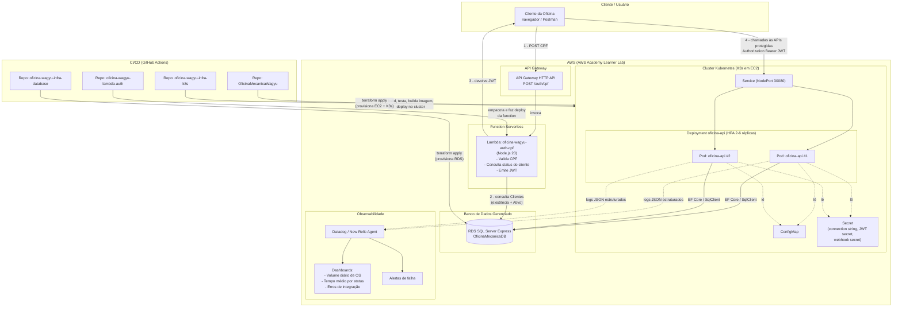

# Diagrama de Componentes — Oficina Mecânica Wagyu (Fase 3)

Este diagrama mostra a arquitetura de nuvem completa: autenticação via CPF,
a aplicação rodando em Kubernetes, o banco de dados gerenciado, a pipeline
de CI/CD e a camada de observabilidade.

## Legenda dos fluxos numerados

1. **Autenticação**: o cliente envia o CPF para o API Gateway, que roteia
   para a Lambda `oficina-wagyu-auth-cpf`.
2. A Lambda consulta a tabela `Clientes` no RDS — checando **existência**
   (documento cadastrado) **e status** (campo `Ativo`).
3. Se o CPF for válido, existir, e o cliente estiver ativo, a Lambda emite
   um **JWT** assinado com um segredo compartilhado (`Jwt__Secret`) e
   devolve ao cliente.
4. O cliente usa esse JWT (`Authorization: Bearer <token>`) para consumir
   as APIs protegidas da aplicação, que rodam como pods no cluster K3s.

## Por que separar Lambda, K8s e Banco em repositórios diferentes

Ver os READMEs de cada repositório
(`oficina-wagyu-lambda-auth`, `oficina-wagyu-infra-k8s`,
`oficina-wagyu-infra-database`) e o RFC de escolha de arquitetura de
implantação (a ser adicionado). Em resumo: o desafio exige repositórios
segregados, cada um com seu próprio pipeline de CI/CD e ciclo de deploy
independente — trocar a versão da Lambda não deveria exigir reaplicar o
Terraform do cluster Kubernetes, por exemplo.

## Onde este diagrama se encaixa nos demais documentos

- **Diagrama de Sequência** (a ser adicionado): detalha, passo a passo, o
  fluxo de autenticação e o fluxo de abertura de uma Ordem de Serviço.
- **RFCs** (a ser adicionado): justificam as escolhas mostradas aqui — por
  que AWS, por que RDS SQL Server, por que K3s em vez de EKS, por que JWT
  compartilhado entre a Lambda e a aplicação.
- **ADRs** (`OficinaMecanicaWagyu/docs/adr/`): decisões arquiteturais
  permanentes, como a arquitetura em camadas/Clean Architecture (ADR-001,
  ADR-002).
