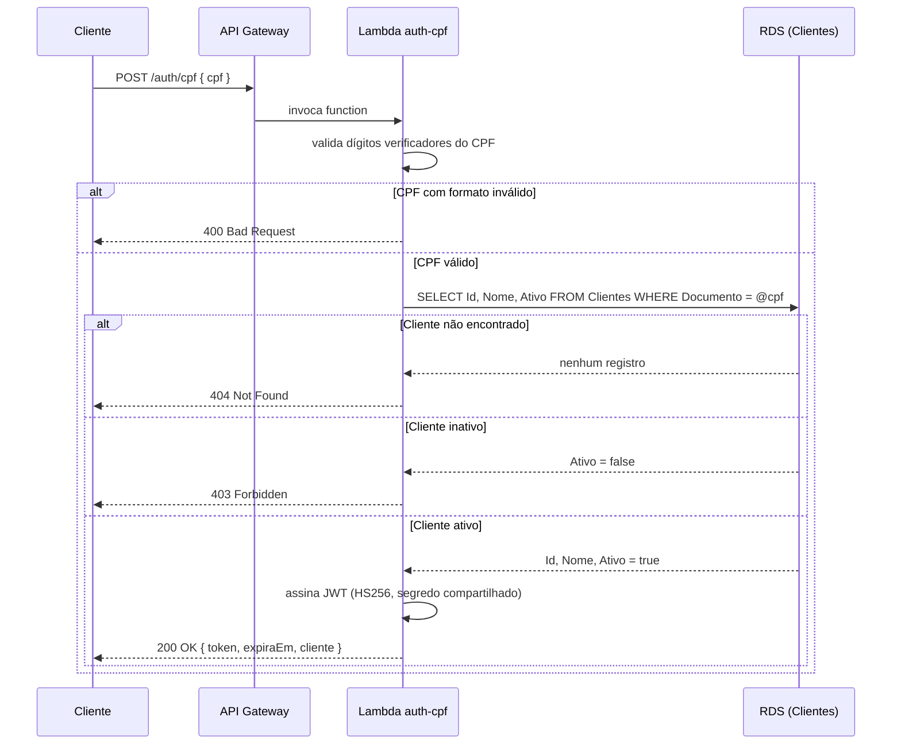
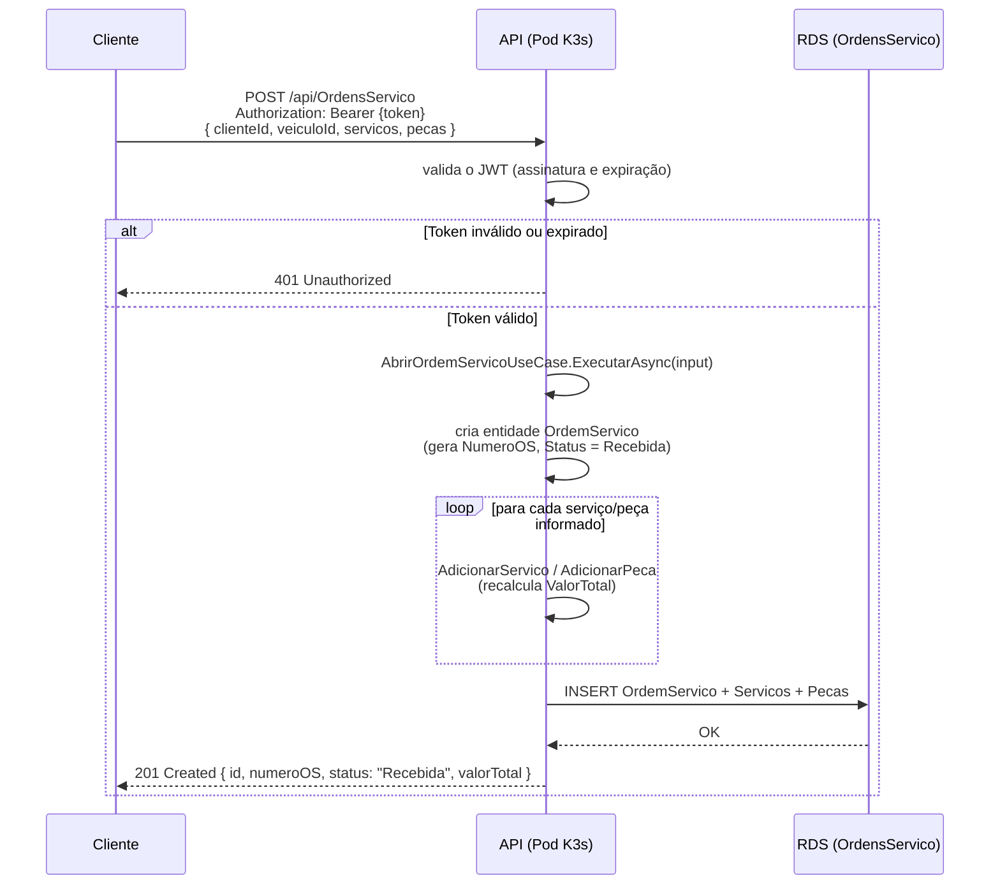

# Diagrama de Sequência — Autenticação via CPF e Abertura de OS

## Fluxo 1 — Autenticação via CPF

## Fluxo 2 — Abertura de Ordem de Serviço

## Notas de implementação

- O JWT emitido pela Lambda usa o mesmo segredo (`Jwt__Secret`) configurado no
  Secret do Kubernetes — é assim que a API, rodando em um processo totalmente
  separado (pod no K3s), consegue validar um token emitido por outro processo
  (a Lambda), sem nenhuma chamada de rede entre os dois no momento da
  validação (validação de JWT é local, apenas verifica a assinatura).
- O `AbrirOrdemServicoUseCase` já existe na camada de Application do
  repositório principal (ver ADR-002 — Clean Architecture) e não precisou de
  nenhuma alteração para a Fase 3; a única mudança foi a origem do token
  (antes: login usuário/senha fixo; agora: também aceita o JWT emitido pela
  Lambda via CPF).
- Erros de validação do CPF (formato, cliente não encontrado, cliente
  inativo) são tratados **dentro da Lambda**, antes de qualquer chamada às
  APIs protegidas — a aplicação principal nunca recebe uma requisição de
  cliente que não deveria ter acesso.
