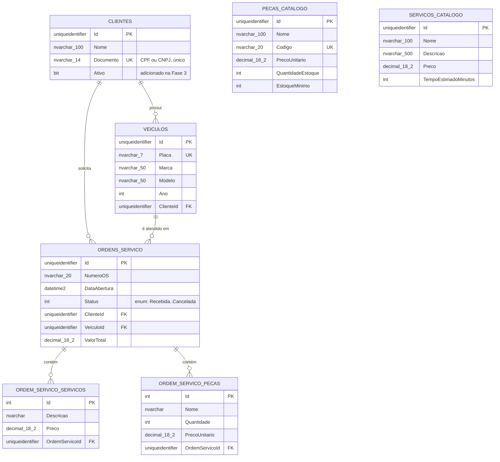

# Justificativa do Banco de Dados e Modelo Relacional

Ver também [RFC-002](../rfcs/RFC-002-escolha-do-banco.md) para a justificativa
da escolha do **motor** de banco (SQL Server via RDS). Este documento cobre o
**modelo relacional** em si: entidades, relacionamentos e ajustes feitos
para a Fase 3.

## Diagrama Entidade-Relacionamento

> **Nota sobre o diagrama:** `Pecas_Catalogo` e `Servicos_Catalogo` são
> tabelas de catálogo (o que a oficina *oferece*), independentes dos itens
> de uma OS (`OrdemServico_Servicos`/`OrdemServico_Pecas`, que são o que foi
> *efetivamente cobrado* naquela ordem específica — valores podem divergir
> do catálogo por desconto, negociação, etc.). Por isso não há uma FK direta
> entre eles no modelo atual; é uma decisão consciente de desnormalização,
> registrada aqui para transparência.

## Relacionamentos e regras de integridade

| Relacionamento | Cardinalidade | Comportamento ao excluir |
|---|---|---|
| Cliente → Veículo | 1:N | Sem cascade configurado (decisão: não permitir exclusão de cliente com veículos associados, tratado a nível de aplicação) |
| Cliente → OrdemServico | 1:N | Idem |
| Veículo → OrdemServico | 1:N | Idem |
| OrdemServico → OrdemServico_Servicos | 1:N | **Cascade** — ao excluir a OS, os itens de serviço são excluídos junto |
| OrdemServico → OrdemServico_Pecas | 1:N | **Cascade** — mesma lógica |

## Ajuste feito na Fase 3: campo `Ativo` em `Clientes`

**Motivação:** o desafio exige que a Function Serverless de autenticação
"consulte a existência **e o status** do cliente na base de dados" antes de
emitir o token JWT. O modelo original (Fase 1/2) não tinha nenhum conceito
de cliente ativo/inativo — só existência.

**Mudança:** adicionada a coluna `Ativo BIT NOT NULL DEFAULT 1` na tabela
`Clientes`, via migration `AddClienteAtivo`. Clientes existentes antes da
migration são automaticamente marcados como ativos (valor padrão `1`),
preservando o comportamento anterior sem exigir intervenção manual.

**Uso:** a Lambda `oficina-wagyu-auth-cpf` consulta esse campo e retorna
`403 Forbidden` se `Ativo = false`, mesmo que o CPF seja válido e esteja
cadastrado — ver [RFC-003](../rfcs/RFC-003-estrategia-autenticacao.md) e o
[Diagrama de Sequência](./diagrama-sequencia.md).

## Índices relevantes

- `Clientes.Documento` — índice único (evita CPFs/CNPJs duplicados; também
  acelera a consulta feita pela Lambda a cada autenticação, que é uma
  operação de leitura de alta frequência esperada)
- `Veiculos.Placa` — índice único
- `PecasCatalogo.Codigo` — índice único

## Por que manter SQL Server em vez de migrar (resumo)

Ver [RFC-002](../rfcs/RFC-002-escolha-do-banco.md) para a análise completa.
Em resumo: a base de migrations e o provider EF Core já validados nas Fases
1 e 2 tornam a troca de motor um risco desnecessário dado o prazo da Fase 3,
sem nenhum requisito do desafio que exija especificamente um banco
open-source.
